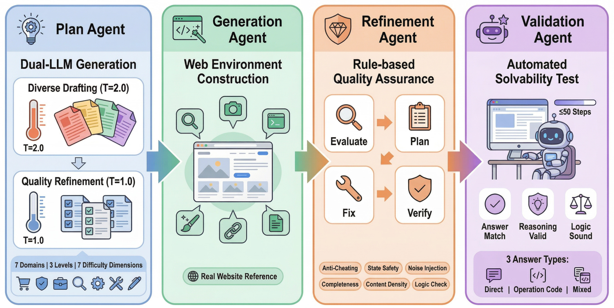
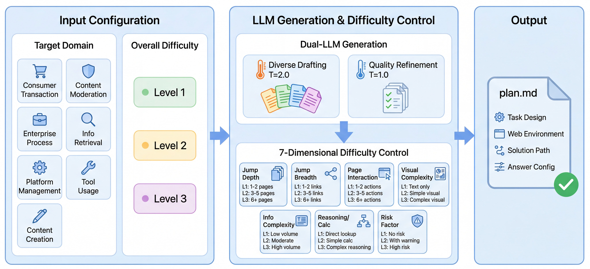
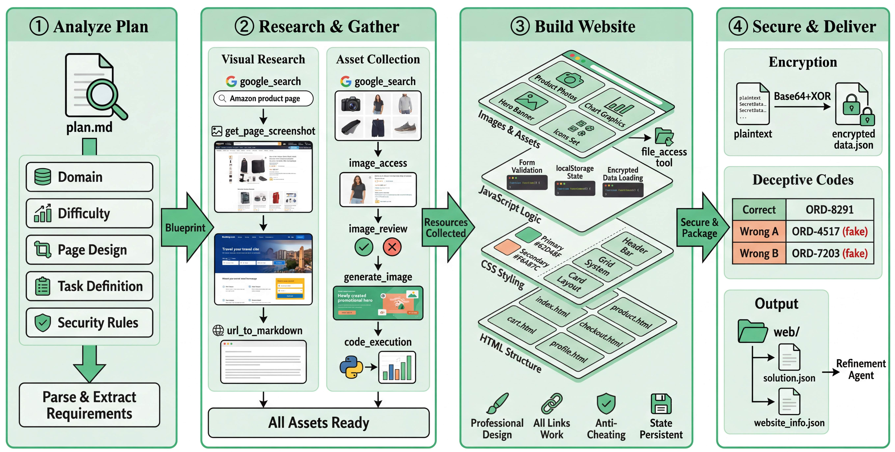
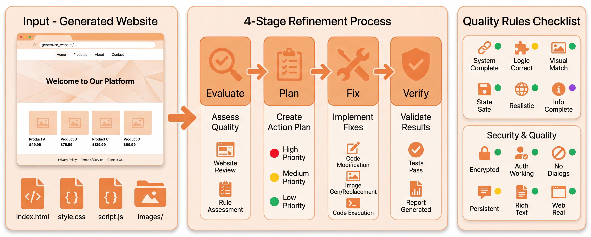
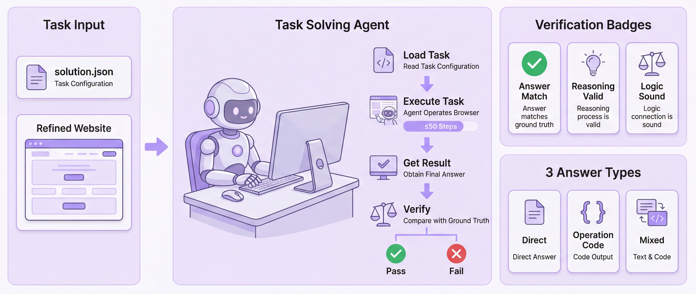

<h1 align="center">WebForge</h1>

<h3 align="center">Breaking the Realism-Reproducibility-Scalability Trilemma<br>in Browser Agent Benchmark</h3>

<p align="center">
  <a href="https://arxiv.org/abs/2604.10988"></a>
  <a href="https://huggingface.co/datasets/yuandaxia/WebForge"></a>
  <a href="./README_zh.md"></a>
  <a href="./LICENSE"></a>
</p>

<p align="center">
  <b>WebForge</b> is the first fully automated framework for constructing realistic, reproducible, and scalable browser agent benchmarks with multi-dimensional difficulty control.
</p>

---

## Quick Start

### 1. Setup Environment

```bash
git clone https://github.com/yuandaxia2001/WebForge.git
cd WebForge

conda create -n webforge python=3.11 -y
conda activate webforge

pip install -r requirements.txt
playwright install chromium
```

### 2. Configure

```bash
cp config.example.yaml config.yaml
# Edit config.yaml — fill in your API key
```

Only required change:

```yaml
llm:
  model: "gemini-2.5-flash"        # or any OpenAI-compatible model
  base_url: "https://..."           # your API endpoint
  api_key: "your-api-key-here"      # <-- replace this
```

See [`config.example.yaml`](./config.example.yaml) for all parameters with detailed comments.

### 3. Download WebForge-Bench

```bash
huggingface-cli download yuandaxia/WebForge --repo-type dataset --local-dir ./benchmark_data
```

### 4. Run Evaluation

```bash
# Test with a single task
python run_eval.py \
    --config config.yaml \
    --task-file benchmark_data/tasks.jsonl \
    --task-id 0bb8a4f7e6919eca \
    --website-dir benchmark_data/websites

# Run all 934 tasks
python run_eval.py \
    --config config.yaml \
    --task-file benchmark_data/tasks.jsonl \
    --website-dir benchmark_data/websites
```

| Option | Description | Default |
|--------|-------------|---------|
| `--config` | YAML config file | (required) |
| `--task-file` | Path to `tasks.jsonl` | (required) |
| `--website-dir` | Path to `websites/` | (required) |
| `--task-id` | Run specific task by ID | all tasks |
| `--output-dir` | Output directory | `./output` |
| `--port` | HTTP server port | `8000` |

### 5. Judge Results

After evaluation completes, run the judge to score agent answers against ground truth:

```bash
# Judge all completed tasks and print accuracy
python run_judge.py \
    --config config.yaml \
    --output-dir ./output

# With per-task CSV export
python run_judge.py \
    --config config.yaml \
    --output-dir ./output \
    --save-csv accuracy.csv
```

The judge LLM compares each agent's `answer` against `ground_truth` and outputs overall accuracy. Configure `judge_llm` in your `config.yaml` (a fast cheap model like `gemini-2.0-flash` is recommended).

---

## Agent Variants

Set `agent.type` in your config:

| Type | Tools | Recommended For |
|------|-------|-----------------|
| `full` | `record_step` + `browser_use` + `terminate` | Frontier models (Gemini, Claude, Kimi) — logs observation/reasoning/action at each step |
| `simple` | `browser_use` + `terminate` | Smaller models (GPT-5-Mini/Nano, Qwen-Omni) — no multi-tool-call requirement |

## Output Format

Each task produces `output/{task_id}/result.json`:

```json
{
  "task_prompt": "...",
  "ground_truth": "50 GB",
  "success": true,
  "answer": "The Enterprise plan allows a maximum file upload size of 50 GB.",
  "steps": [
    {
      "step": 1,
      "observation": "I see the Platform Plans & Limits article...",
      "reasoning": "This section covers file limits across plans...",
      "action": "Click on Platform Plans & Limits at index 7"
    }
  ],
  "llm_turns": 2,
  "elapsed_time_seconds": 15.08,
  "stats": { "total_steps": 2, "total_actions": 1, "token_usage": { "prompt_tokens": 7857, "completion_tokens": 198 } }
}
```

Execution traces (screenshots + actions) are saved in `output/{task_id}/trace/`.

---

## Evaluation Protocol

WebForge uses **final-state evaluation**: only the agent's final answer is compared against ground truth.

| Answer Type | Description |
|-------------|-------------|
| **Direct Answer** | Agent reports a concrete value (price, date, etc.) |
| **Operation Code** | Website computes a unique code from agent's accumulated state |
| **Mixed** | Both direct answer and operation code |

An evaluator LLM performs a simple comparison — no complex semantic judgment needed.

---

## Project Structure

```
.
├── run_eval.py                    # Step 1: Run agent evaluation
├── run_judge.py                   # Step 2: Judge answers against ground truth
├── config.example.yaml            # Configuration template
├── requirements.txt               # Python dependencies
├── LICENSE                        # Apache 2.0
├── assets/                        # Pipeline figures
├── agents/                        # Agent runners
│   ├── browser_use_agent/         # Full agent (with record_step)
│   └── browser_use_simple_agent/  # Simplified agent
└── aiground/                      # Core framework
    ├── browser_agent_service/     # Agent implementations
    ├── common/                    # Shared utilities
    ├── framework/thirdparty/      # Browser automation & LLM framework
    └── prompts/                   # System prompts
```

---

## The Benchmark Trilemma

Existing browser agent benchmarks cannot simultaneously be **realistic**, **reproducible**, and **scalable**:

| | Real-website (e.g., WebVoyager) | Controlled (e.g., WebArena) | **WebForge (Ours)** |
|---|---|---|---|
| Realistic | ✅ Real content | ❌ No pop-ups, no noise | ✅ Real data + injected noise |
| Reproducible | ❌ Content drift | ✅ Self-contained | ✅ Self-contained static sites |
| Scalable | ❌ Manual curation | ❌ Manual curation | ✅ Fully automated pipeline |

WebForge resolves this trilemma through a **four-agent pipeline** that produces interactive, self-contained web environments end-to-end with zero human annotation.

---

## Pipeline Overview

<p align="center">
  
</p>

WebForge constructs benchmarks through four stages: **Plan → Generate → Refine → Validate**.

### Plan Agent

The Plan Agent converts a target domain and difficulty level into a structured task blueprint using a dual-LLM process: high-temperature drafting (T=2.0) for creative diversity, followed by low-temperature refinement (T=1.0) for constraint verification.

<details>
<summary>📐 Plan Agent workflow</summary>
<p align="center"></p>
</details>

### Generation Agent

The Generation Agent builds fully functional websites with real data, anti-cheating mechanisms, and `localStorage`-based stateful interactions.

<details>
<summary>🏗️ Generation Agent workflow</summary>
<p align="center"></p>
</details>

### Refinement Agent

The Refinement Agent injects real-web noise (pop-ups, cookie dialogs, network delays) and fixes dead links, broken forms, and other quality issues.

<details>
<summary>🔧 Refinement Agent workflow</summary>
<p align="center"></p>
</details>

### Validation Agent

The Validation Agent replays the solution path in a real Chromium browser to verify every task is solvable within 50 steps.

<details>
<summary>✅ Validation Agent workflow</summary>
<p align="center"></p>
</details>

---

## WebForge-Bench

**934 tasks** · **7 domains** · **3 difficulty levels** · **7-dimensional difficulty control**

The benchmark dataset is hosted on [🤗 HuggingFace](https://huggingface.co/datasets/yuandaxia/WebForge). This repository provides the evaluation agent code.

### Benchmark Comparison

| Benchmark | Type | #Tasks | #Dom. | Diff. Ctrl | Noise | Auto | Reprod. | Eval Paradigm |
|-----------|------|--------|-------|------------|-------|------|---------|---------------|
| Mind2Web | Real | 2,350 | 137† | ✗ | ✗ᵃ | ✗ | ✗ᵇ | Step-wise pred. |
| WebVoyager | Real | 643 | 15† | ✗ | Passive | ✗ | ✗ | LMM-judge |
| MMInA | Real | 1,050 | 14† | ✗ | Passive | ✗ | ✗ | Hop SR |
| WebArena | Ctrl | 812 | 4 | ✗ | ✗ | ✗ | ✓ | Programmatic |
| VisualWebArena | Ctrl | 910 | 3 | 2-dimᶜ | ✗ | ✗ | ✓ | Hand-crafted |
| WorkArena++ | Ctrl | 682 | 1 | 1-dimᵈ | ✗ | ✗ | ✓ | Oracle fn |
| EntWorld | Ctrl | 1,756 | 6 | Post-hocᵉ | ✗ | Partialᶠ | ✓ | SQL verification |
| TheAgentCompany | Ctrl | 175 | 1ᵍ | ✗ | Partial | ✗ | ✓ | Checkpoint |
| **WebForge (Ours)** | **Auto** | **934** | **7** | **7-dim × 3** | **✓** | **✓** | **✓** | **Final-state** |

<sub>†Number of websites, not thematic domains. ᵃAnnotation protocol explicitly excludes pop-ups and CAPTCHAs. ᵇ~50% of tasks expired within two years. ᶜAction difficulty + visual difficulty, annotated post hoc. ᵈControls instruction explicitness only. ᵉWeighted score over 5 SQL-structural dimensions, computed post hoc. ᶠTask instantiation automated; environment deployment manual. ᵍSingle simulated company with 7 job categories.</sub>

---

## Main Results

Accuracy (%) of 14 model configurations on WebForge-Bench (934 tasks).

<details>
<summary><b>Table 1: Main Results — Difficulty Level & Cross-Domain</b></summary>

| | | Difficulty Level | | | | Cross-Domain | | | | | |
|---|:---:|:---:|:---:|:---:|:---:|:---:|:---:|:---:|:---:|:---:|:---:|
| **Model** | **L1** | **L2** | **L3** | **ALL** | **D1** | **D2** | **D3** | **D4** | **D5** | **D6** | **D7** |
| *(a) Multimodal (Screenshot + DOM)* | | | | | | | | | | | |
| Gemini-3-Pro | **86.4** | **82.1** | **58.0** | **75.9** | **72.2** | 67.2 | **82.4** | **79.4** | 71.0 | **76.6** | **80.9** |
| Gemini-3-Flash | 82.4 | 73.5 | 44.0 | 67.1 | 65.2 | 61.6 | 66.4 | 62.5 | **74.0** | 66.0 | 74.8 |
| Gemini-2.5-Flash-Lite | 58.5 | 33.5 | 12.6 | 35.0 | 34.8 | 28.8 | 26.7 | 41.9 | 38.2 | 33.3 | 39.7 |
| Claude-4.5-Sonnet | 85.7 | 74.7 | 48.1 | 69.9 | 58.3 | **70.4** | 71.8 | 73.8 | 69.5 | 67.4 | 76.3 |
| GPT-5.2 | 80.1 | 65.9 | 31.1 | 59.5 | 48.7 | 58.4 | 51.1 | 64.4 | 57.3 | 63.1 | 71.0 |
| GPT-5-Mini | 82.4 | 68.2 | 28.7 | 60.4 | 51.3 | 56.8 | 50.4 | 73.8 | 60.3 | 58.2 | 67.9 |
| GPT-5-Nano | 61.8 | 25.9 | 6.1 | 31.3 | 20.9 | 29.6 | 29.0 | 43.8 | 31.3 | 29.8 | 30.5 |
| Kimi-K2.5 | 84.4 | 73.8 | 39.2 | 66.4 | 60.0 | 61.6 | 65.6 | 75.6 | 62.6 | 61.7 | 74.8 |
| Qwen3-VL-235B | 73.4 | 50.3 | 20.1 | 48.3 | 37.4 | 40.8 | 46.6 | 58.8 | 51.1 | 48.2 | 51.1 |
| Qwen3-Omni-30B | 26.9 | 9.1 | 2.4 | 12.7 | 6.1 | 9.6 | 7.6 | 26.2 | 10.7 | 12.1 | 13.0 |
| *(b) Text-only (DOM only)* | | | | | | | | | | | |
| DeepSeek-V3.2 | 77.1 | 47.4 | 21.5 | 48.8 | 54.8 | 46.4 | 48.9 | 45.6 | 49.6 | 48.2 | 49.6 |
| GLM-4.7 | 76.4 | 49.4 | 24.2 | 50.2 | 50.4 | 43.2 | 55.7 | 48.8 | 52.7 | 48.9 | 51.9 |
| Gemini-3-Pro (T) | 80.1 | 61.8 | 34.8 | 59.2 | 61.7 | 56.0 | 61.1 | 57.5 | 59.5 | 56.7 | 62.6 |
| Gemini-3-Flash (T) | 78.7 | 50.9 | 23.2 | 51.2 | 54.8 | 45.6 | 52.7 | 43.8 | 55.0 | 51.8 | 56.5 |
| **Average** | **73.9** | **54.8** | **28.1** | **52.6** | **48.3** | **48.3** | **51.1** | **56.9** | **53.1** | **51.6** | **57.2** |

> D1: Consumer Transaction, D2: Content Moderation, D3: Enterprise Process, D4: Info Retrieval, D5: Platform Management, D6: Tool Usage, D7: Content Creation. (T) = text-only mode (DOM only, no screenshots).

</details>

<details>
<summary><b>Table 2: Runtime Efficiency (averaged per task)</b></summary>

| | Level 1 | | | | Level 2 | | | | Level 3 | | | |
|---|:---:|:---:|:---:|:---:|:---:|:---:|:---:|:---:|:---:|:---:|:---:|:---:|
| **Model** | **Turns** | **Acts** | **Prompt** | **Compl** | **Turns** | **Acts** | **Prompt** | **Compl** | **Turns** | **Acts** | **Prompt** | **Compl** |
| Gemini-3-Pro | 7.9 | 12.2 | 133K | 4.2K | 13.8 | 21.6 | 307K | 5.9K | 26.9 | 44.6 | 1036K | 11.2K |
| Gemini-3-Flash | 8.0 | 12.3 | 159K | 5.5K | 13.1 | 19.3 | 304K | 6.5K | 25.3 | 39.1 | 962K | 15.3K |
| Gemini-2.5-Flash-Lite† | 12.0 | 6.6 | 224K | 4.6K | 16.5 | 11.5 | 254K | 3.4K | 26.1 | 21.9 | 520K | 5.6K |
| Claude-4.5-Sonnet | 11.0 | 12.3 | 260K | 3.8K | 18.7 | 20.7 | 591K | 6.9K | 33.8 | 37.4 | 1608K | 12.6K |
| GPT-5.2† | 8.8 | 8.5 | 80K | 0.4K | 15.6 | 16.1 | 236K | 0.6K | 26.1 | 27.7 | 656K | 1.0K |
| GPT-5-Mini† | 11.5 | 10.5 | 150K | 2.2K | 20.7 | 19.7 | 421K | 4.2K | 36.7 | 36.0 | 1164K | 9.7K |
| GPT-5-Nano† | 18.1 | 13.7 | 277K | 9.4K | 29.3 | 23.3 | 590K | 19.5K | 38.4 | 30.8 | 892K | 31.3K |
| Kimi-K2.5 | 13.3 | 11.1 | 176K | 3.2K | 21.1 | 19.8 | 385K | 5.8K | 36.2 | 34.6 | 904K | 10.5K |
| Qwen3-VL-235B | 9.0 | 9.2 | 135K | 1.9K | 16.2 | 17.4 | 363K | 3.7K | 28.7 | 32.4 | 845K | 6.9K |
| Qwen3-Omni-30B† | 34.3 | 6.9 | 463K | 4.4K | 43.2 | 6.8 | 641K | 6.6K | 46.8 | 8.0 | 740K | 7.1K |
| DeepSeek-V3.2 | 12.4 | 11.7 | 165K | 3.5K | 22.7 | 24.2 | 420K | 6.6K | 36.3 | 40.9 | 920K | 10.5K |
| GLM-4.7 | 11.6 | 12.8 | 138K | 3.7K | 22.7 | 25.6 | 376K | 7.5K | 34.4 | 40.2 | 761K | 11.5K |
| Gemini-3-Pro (T) | 10.6 | 16.8 | 144K | 5.4K | 21.6 | 33.9 | 412K | 8.9K | 33.7 | 57.7 | 875K | 13.2K |
| Gemini-3-Flash (T) | 10.5 | 15.4 | 213K | 7.5K | 29.8 | 47.1 | 854K | 26.1K | 41.4 | 65.5 | 1328K | 29.9K |

> Turns = LLM dialogue rounds; Acts = browser actions; Prompt/Compl = input/output tokens. Models marked † do not support step-level logging, resulting in lower token counts.

</details>

<details>
<summary><b>Table 3: Per-Dimension Accuracy (%)</b></summary>

| | Jump Depth | | | Jump Breadth | | | Page Interact. | | | Visual Compl. | | | Info Compl. | | | Reason./Calc | | | Risk Factor | | |
|---|:---:|:---:|:---:|:---:|:---:|:---:|:---:|:---:|:---:|:---:|:---:|:---:|:---:|:---:|:---:|:---:|:---:|:---:|:---:|:---:|:---:|
| **Model** | L1 | L2 | L3 | L1 | L2 | L3 | L1 | L2 | L3 | L1 | L2 | L3 | L1 | L2 | L3 | L1 | L2 | L3 | L1 | L2 | L3 |
| Gemini-3-Pro | **86.5** | **78.9** | **60.2** | 84.8 | **79.9** | **51.2** | **84.0** | **74.9** | **65.0** | **90.8** | **78.9** | **55.8** | **84.7** | **75.7** | **53.2** | **91.4** | **74.6** | **58.3** | **80.6** | **70.3** | 23.1 |
| Gemini-3-Flash | 82.3 | 71.1 | 45.1 | 83.8 | 67.6 | 45.7 | 74.6 | 67.8 | 47.0 | 83.1 | 69.0 | 46.8 | 81.2 | 64.0 | 39.0 | 84.7 | 68.3 | 42.6 | 72.2 | 60.0 | **38.5** |
| Gemini-2.5-Flash-Lite | 57.3 | 33.2 | 13.5 | 56.0 | 34.3 | 13.0 | 52.1 | 33.3 | 9.0 | 54.7 | 34.2 | 13.0 | 50.4 | 28.6 | 13.5 | 56.8 | 31.7 | 12.8 | 42.7 | 23.7 | 0.0 |
| Claude-4.5-Sonnet | 85.8 | 71.8 | 50.0 | **85.9** | 70.7 | 48.1 | 81.7 | 69.2 | 49.0 | 86.5 | 69.0 | 51.5 | 81.2 | 66.9 | 48.9 | 87.4 | 70.4 | 46.8 | 76.4 | 60.9 | 30.8 |
| GPT-5.2 | 79.2 | 62.9 | 33.5 | 76.4 | 62.8 | 27.8 | 71.8 | 58.1 | 42.0 | 84.5 | 58.1 | 31.9 | 74.0 | 58.1 | 25.5 | 86.0 | 59.0 | 26.4 | 67.3 | 48.6 | 15.4 |
| GPT-5-Mini | 81.2 | 66.1 | 29.7 | 82.2 | 63.0 | 25.3 | 80.8 | 59.4 | 23.0 | 83.7 | 62.7 | 31.2 | 77.2 | 56.4 | 27.7 | 84.7 | 61.8 | 26.8 | 71.1 | 44.3 | 23.1 |
| GPT-5-Nano | 61.8 | 26.1 | 5.6 | 59.2 | 28.7 | 7.4 | 61.5 | 25.4 | 3.0 | 50.1 | 27.8 | 12.6 | 47.2 | 24.3 | 9.9 | 51.2 | 30.9 | 6.4 | 40.3 | 17.7 | 0.0 |
| Kimi-K2.5 | 84.7 | 70.3 | 41.0 | 83.8 | 70.1 | 32.7 | 81.2 | 65.1 | 43.0 | 84.2 | 71.5 | 40.9 | 79.9 | 62.6 | 41.8 | 86.4 | 67.3 | 39.1 | 75.0 | 54.3 | 15.4 |
| Qwen3-VL-235B | 72.2 | 48.9 | 21.4 | 70.7 | 49.1 | 19.1 | 69.0 | 46.1 | 18.0 | 73.9 | 44.7 | 21.9 | 63.0 | 45.0 | 19.1 | 75.1 | 45.5 | 18.7 | 58.7 | 32.3 | 23.1 |
| Qwen3-Omni-30B | 27.1 | 8.9 | 2.6 | 23.0 | 11.9 | 3.7 | 27.2 | 9.7 | 1.0 | 24.1 | 10.2 | 2.0 | 17.2 | 11.9 | 3.5 | 24.3 | 9.8 | 3.0 | 18.4 | 4.0 | 0.0 |
| DeepSeek-V3.2 | 76.4 | 45.8 | 23.3 | 71.7 | 48.9 | 21.6 | 58.2 | 51.2 | 14.0 | 81.7 | 39.8 | 19.3 | 67.3 | 42.4 | 19.1 | 79.4 | 43.0 | 19.6 | 56.2 | 38.0 | 15.4 |
| GLM-4.7 | 75.7 | 47.4 | 26.7 | 72.3 | 51.6 | 19.1 | 58.7 | 51.4 | 25.0 | 84.2 | 39.8 | 20.6 | 66.8 | 44.5 | 23.4 | 81.7 | 43.2 | 21.7 | 56.6 | 41.4 | 7.7 |
| Gemini-3-Pro (T) | 79.5 | 59.7 | 36.5 | 77.5 | 61.4 | 29.6 | 66.2 | 60.2 | 38.0 | 87.4 | 56.7 | 28.9 | 74.0 | 55.2 | 31.9 | 87.7 | 52.0 | 34.9 | 64.6 | 52.0 | 15.4 |
| Gemini-3-Flash (T) | 78.1 | 48.9 | 25.2 | 73.3 | 52.0 | 22.2 | 57.3 | 52.5 | 30.0 | 86.0 | 42.6 | 18.9 | 69.2 | 45.0 | 22.0 | 82.7 | 45.5 | 20.4 | 58.0 | 41.7 | 7.7 |

</details>

---

## Citation

```bibtex
@article{yuan2026webforge,
  title={WebForge: Breaking the Realism-Reproducibility-Scalability Trilemma in Browser Agent Benchmark},
  author={Yuan, Peng and Yin, Yuyang and Cai, Yuxuan and Wei, Zheng},
  year={2026}
}
```

## License

[Apache License 2.0](./LICENSE)

## Acknowledgments

Built upon [browser-use](https://github.com/browser-use/browser-use), [OpenManus](https://github.com/FoundationAgents/OpenManus), and [Playwright](https://playwright.dev/).
